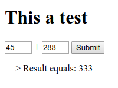

# nodejs-form-sample
Example of using form input with nodeJS to return result in single page webapp

###Instructions

1. `git clone https://github.com/mittman/nodejs-form-sample.git`
2. `cd nodejs-form-sample/`
3. `npm install`
4. `npm start`
5. Navigate to [localhost:8080](http://localhost:8080)

###Licensing
Copyright &copy; 2016

Licensed under the [MIT](LICENSE) (aka X11) license.
